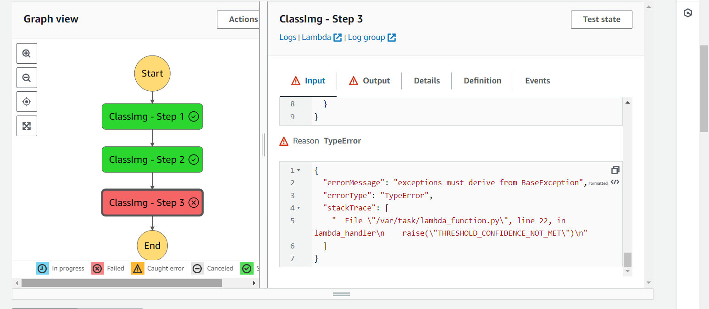
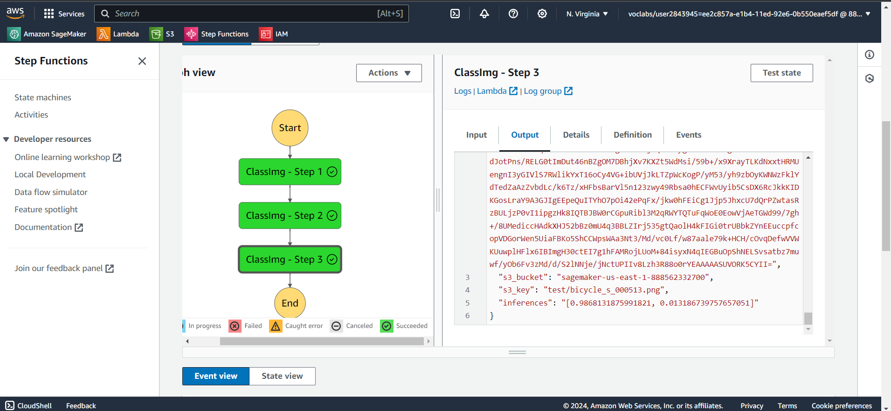

# Building an Image Classification ML Worflow for Scones Unlimited

## Introduction

In this project AWS Sagemaker is used to build an image classification model that can tell bicycles apart from motorcycles. The model is deployed as an endpoint. AWS Lambda functions and AWS Step Functions is used to build supporting devices and compose the model and services into an event-driven application. 

## Project Setup Instructions

### Prerequisites

- An AWS account with access to Amazon SageMaker, S3, AWS Lambda and Step Functions
- Python 3.x installed.

### Environment Setup

1. **Create a SageMaker Notebook Instance**: Log into the AWS Management Console, navigate to the SageMaker service, and create a new notebook instance.
2. **Access the Notebook**: Once the instance is in 'InService' status, open Jupyter/JupyterLab from the SageMaker console.
3. **Clone the Project Repository**: Clone the [repository](https://github.com/udacity/udacity-nd009t-C2-Developing-ML-Workflow/tree/master/project) to your local environment within the Jupyter notebook instance.

### Dataset

This project uses the [CIFAR-10 dataset](https://www.cs.toronto.edu/~kriz/cifar-100-python.tar.gz) . From this dataset, only images of bicycles and motorcycles is used. 

## Project Steps

The project involves the following steps:
1. Data Staging
2. Model Training and Deployment
3. Lambdas and Step function workflow
4. Testing and Evaluation

## Explanations of the Different Files

### `final_notebook_submission.ipynb`
- **Purpose**: Comprehensive notebook containing the code running the entire ML Workflow

### `execution-detail.json`
- **Purpose**: Shows the execution detail of a succesful execution of a step function.

### `lambda.py.py`
- **Purpose**: Shows the code used in the three lambda functions

## Step function images

